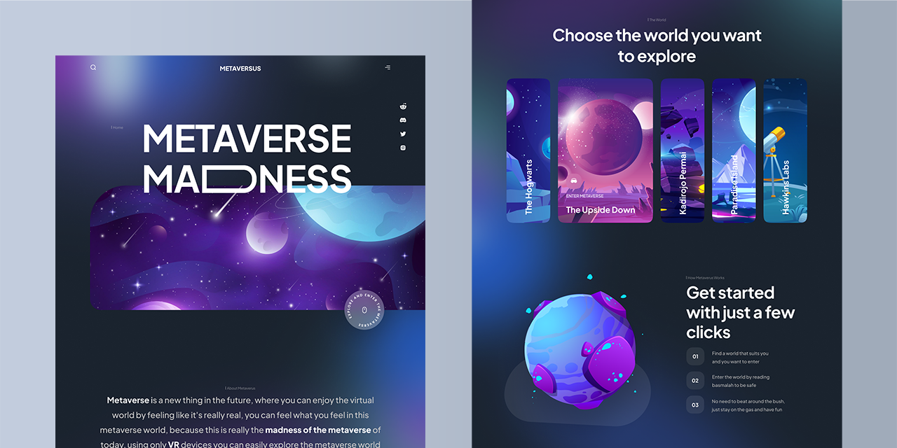
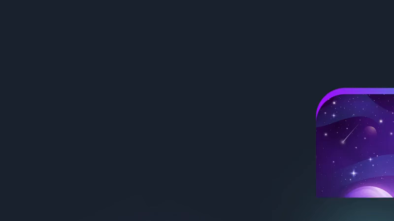
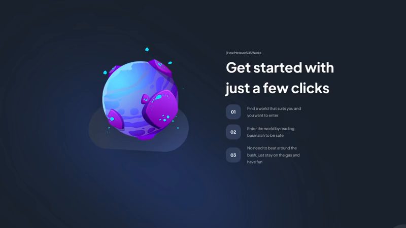
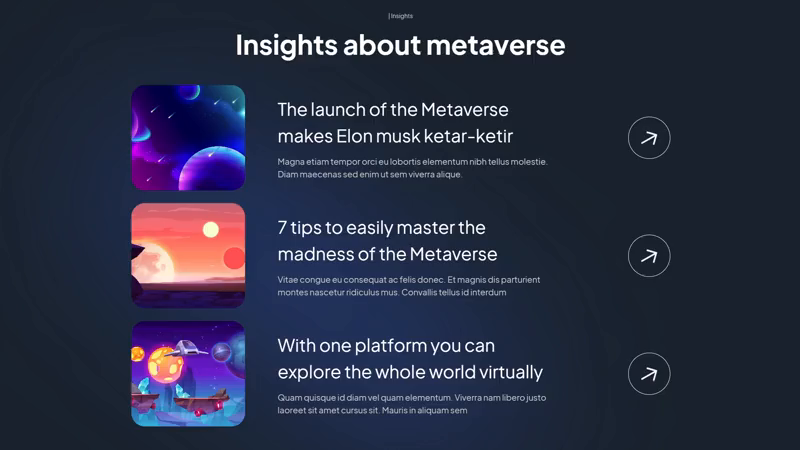
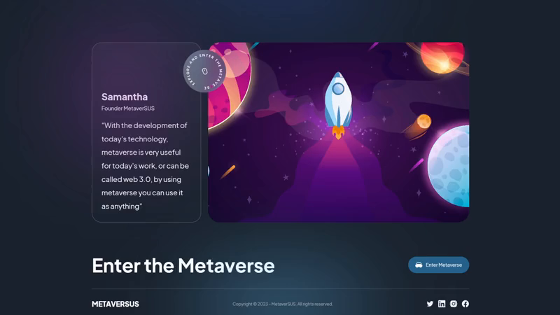

# METAVERSUS



---

I learned to build a modern UI/UX website with:

- [Next.js](https://nextjs.org/)
- [React](https://reactjs.org/)
- [Tailwind CSS](https://tailwindcss.com/)
- [Framer Motion](https://www.framer.com/motion/)

## Design Breakdown

### Hero Section



#### General Motion Wrapper

Almost all sections in this design begin with a parent motion wrapper - Framer `<motion.div>`, that wrap around the entire section/components and apply section-wide Framer `AnimationProps` and Tailwind `className` styles.

```jsx
<motion.nav
  variants={sectionVariants}
  initial="hidden"
  whileInView="show"
  className={`${styles.customStyles} additional-tailwind-styles`}
>
  // ...
</motion.nav>
```

The `sectionVariants` usually have animation properties customised for each section or component. This contains the animation properties to render consisting of 2 types `hidden` and `show`.

As most of the components are rendered and animated when scrolled into the viewport, `sectionVariants` specify `AnimationProps` such as `position`, `transition`, `type`, `opacity`, etc. of the animation between the `initial` state and the `whileInView` state.

#### Navigation Bar

The `Navbar` component starts with motion wrapper that has the following `navVariants`:

```js
export const navVariants = {
  hidden: {
    opacity: 0,
    y: -50,
    transition: {
      type: 'spring',
      stiffness: 300,
      damping: 140,
    },
  },
  show: {
    opacity: 1,
    y: 0,
    transition: {
      type: 'spring',
      stiffness: 80,
      delay: 1,
    },
  },
};
```

The `y` prop set to `-50` while `hidden` gives the `Navbar` a drop-down animation effect whenever it comes into view (by scrolling to the top of the Hero section).

Other than that, the content of the `Navbar` is pretty simple. We have an `img` tag for the `search.svg`, `h2` for the "METAVERSUS" title, and another `img` tag for the hamburger `menu.svg`. All these 3 tags are wrapped inside a `div` with `justify-between` style.

One intersting thing we implement in this `Navbar` is a gradient layer, by adding the class of `gradient-01` in a self-closing `div` right above our content wrapper `div`.

```jsx
<div className="absolute w-[50%] inset-0 gradient-01" />
```

An example colour gradient can be found in `../styles/global.css`:

```css
.gradient-01 {
  background-image: linear-gradient(
    270deg,
    hsl(295deg 76% 51%) 0%,
    hsl(284deg 70% 73%) 26%,
    hsl(257deg 70% 86%) 39%,
    hsl(202deg 92% 90%) 50%,
    hsl(215deg 77% 81%) 61%,
    hsl(221deg 73% 70%) 74%,
    hsl(220deg 76% 51%) 100%
  );
  filter: blur(125px);
}
```

#### The "Actual" Hero Section

The `Hero` section starts with a `<motion.div>` wrapper, that has the `staggerContainer` motion variant. This animation setting will be used for the rest of the sections in this design:

```js
export const staggerContainer = (staggerChildren, delayChildren) => ({
  hidden: {},
  show: {
    transition: {
      staggerChildren,
      delayChildren,
    },
  },
});
```

Read more about [staggerChildren](https://www.framer.com/motion/transition/###staggerchildren) and [delayChildren](https://www.framer.com/motion/transition/###delaychildren) on Framer official docs.

##### Metaverse MaDDDness title

The upper title, "Metaverse", is simply just a `<motion.h1>` element.

```jsx
<motion.h1 variants={textVariant(1.1)} className={/*styling goes here*/}>
```

Here notice the `textVariant` function, we pass in `1.1` to specify the delay duration (in seconds) of the animation. This variant is similar to the `navVariants` above.

We still use the same `spring` transition type, with the `y` offset of `50px` this time (not `-50px`) to create a sliding-up animation effect (in contrast to the `Navbar` drop-down effect).

The "Madness" part with the long "D" is basically comprised of: a `h1` for "MA", a border-bent `div` to make the long letter "D", and another `h1` for "NESS". Here are the Tailwind styles to bend the `div` border:

```css
md:w-[212px] sm:w-[80px] w-[60px] md:h-[108px] sm:h-[48px] h-[38px] md:border-[18px] border-[9px] rounded-r-[50px] border-white sm:mx-2 mx-[6px]
```

Also for this "Madness" part, we pass in the `variants={textVariant(1.2)}` to make it slide-up slightly after the "Metaverse" part.

##### Cover image sliding from the right

The cover `img` tag is wrapped inside another `<motion.div>` with the following props:

```jsx
variants={slideIn('right', 'tween', 0.2, 1)}
```

We pass in the slide `direction`, transition `type`, `delay`, and `duration`. Here is the code for the `slideIn` motion:

```js
export const slideIn = (direction, type, delay, duration) => ({
  hidden: {
    x: direction === 'left' ? '-100%' : direction === 'right' ? '100%' : 0,
    y: direction === 'up' ? '100%' : direction === 'down' ? '100%' : 0,
  },
  show: {
    x: 0,
    y: 0,
    transition: {
      type,
      delay,
      duration,
      ease: 'easeOut',
    },
  },
});
```

The cover img also has a background gradient `div`. The CSS code for `hero-gradient` can be found in `global.css`, similar to the `Navbar` gradient we mentioned before.

```jsx
<div className="absolute w-full h-[300px] hero-gradient rounded-tl-[140px] z-0 -top-[30px]" />
```

##### The stamp

There is also a stamp button that will take us to the `Explore` section when clicked on. It is just a simple `<a>` tag with an `img` tag inside and the `href` set to `#explore` as we will be assigning this `id` to our `Explore` component.

### About Section


The `About` section starts with a `staggerContainer` motion wrapper. The layout is fairly simple, we can see a small title with a fading-in animation, the text content, and an arrow.

#### Gradient Layer

Above the motion wrapper, we add a gradient layer in a self-closing `div` and set the `z-index` to make it appear on background:

```jsx
<div className="gradient-02 z-0" />
```

Again, for simplicity and readability of the docs, I will not include all the code for motion and styling here. To see the details of styling code, check `../style/global.css`

#### The TypingText Component

This component is used for all the section titles throughout the design. It creates slowly-appearing / typing animation effect for the title.

The component is essentially a `<motion.p>` element that takes in `title` and `textStyles` props. The `title` prop would be the text content we want to animate, while the `textStyles` would be addtional text styling such as `text-center`.

```jsx
export const TypingText = ({ title, textStyles }) => (
  <motion.p
    className={`font-normal text-[14px] text-secondary-white ${textStyles}`}
  >
```

Inside this `motion.p` tag, we want to create the typing effect. We do this by constructing an `Array` from our `title`, then rendering **each letter** in a `motion.span` tag:

```jsx
Array.from(title).map((letter, index) => (
  <motion.span variants={textVariant2} key={index}>
    {letter}
  </motion.span>
));
```

The `textVariant2` motion makes the effect appear smoother by tweaking the value of some props such as `opacity`, transition `type` and `ease`, etc. To see the details of motion code, check `../utils/motion.js`

Finally, in our `About` component, we just simply pass in our section title to the `TypingText` comp:

```jsx
<TypingText title="| About MetaverSUS" textStyles="text-center" />
```

#### Text Content and the Arrow

The rest of the text content is just simply a `motion.p` for the text paragraphs and a `motion.img` for the `arrow-down.svg`:

```jsx
<motion.p variants={fadeIn('up', 'tween', 0.2, 1)} className="styles">
  <span className="font-extrabold text-white">paragraph1</span>
  <span className="font-extrabold text-white">paragraph2</span>
  <span className="font-extrabold text-white">paragraph3</span>
</motion.p>;

<motion.img variants={fadeIn('up', 'tween', 0.3, 1)} src="arrow-down.svg" />;
```

Notice we use the `fadeIn` animation to make text content and the arrow appearing with a fade effect, direction from the bottom-up. This motion variant is similar to the `slideIn` variant (check [above](#cover-image-sliding-from-the-right)).

We also set the arrow delay to be `0.1` second later than the paragraph to make it appear slightly later.

### Explore Section


The `Explore` section starts with a `staggerContainer` motion wrapper. The layout starts with a `TypingText` section title, a heading title, and a series of 5 `ExploreCard` components for the 5 metaverse worlds.

#### The TitleText Component

This component is used for all the heading titles throughout the design.

It is very similar to the `TypingText` comp with the only difference is that it does not render each letter individually, and some minor styling differences in `font-size`, `margins`, `paddings`, etc.

In this section, we use this comp to render the heading texts:

```jsx
<TitleText title="Choose the world you want" textStyles="text-center" />
<TitleText title="to explore" textStyles="text-center" />
```

#### World Wrapper

The 5 world components are wrapped within a `div` with `flex-col` by default to render the world cards vertically on medium and small devices. This wrapper uses `lg:flex-row` on large devices to render the world cards horizontally on wide-screen devices.

Inside this `div`, we map the `exploreWorlds` array, containing each world object prop such as `id`, `title`, `imgUrl`, to the `exploreCard` component to render our worlds.

```jsx
<div className="styling">
  {exploreWorlds.map((world, index) => (
    <ExploreCard
      key={world.id}
      {...world} // spread the world object props: id, title, imgUrl
      index={index}
      active={active}
      handleClick={setActive}
    />
  ))}
</div>
```

Because we need to handle user click in this section to animate the expansion of the world image, we will need to use React `useState` hook in this component.

```jsx
import { useState } from 'react';
```

We first initialise the active state to the 2nd world image.

```jsx
const Explore = () => {
  const [active, setActive] = useState('world-2');
```

Then we can move on to working on our world component.

#### The ExploreCard Component

This comp receives props from each `world` object that is mapped from the `exploreWorlds` array (see [above](#world-wrapper)) along with its `index` and the current `active` state.

```jsx
const ExploreCard = ({ id, imgUrl, title, index, active, handleClick }) => (
  <motion.div
    variants={fadeIn('right', 'spring', index * 0.5, 0.75)}
    className={`${active === id ? 'lg:flex-[3.5] flex-[10]' : 'lg:flex-[0.5] flex-[2]'} addtional-flex-styling`}
    onClick={() => handleClick(id)}
  >
```

##### Make the world card expand on click

We use each world object `index` as a mutiplier for the delay prop in the `fadeIn` animation. So that it will create an effect of each world appearing one-by-one as we scroll through.

To make the world image expand, we check for current `active` prop with the world object `id`, if it matches _(the current world is active)_ then its `flex` attributes will be set to expand more than the others.

Then finally, the `onClick()` handler is set to change the `active` world by its `id`, `handleClick` will run `setActive` as we use React `useState` hook in our main `Explore` section (see [above](#world-wrapper)).

##### Make the world title rotate vertically

On non-active world, the title is set to rotate `-90 degrees`. Note that this effect only applied to `large` devices where the world cards are flex horizontally. On `small` and `medium` devices, the world cards are flex vertically, so the title does not change its position / rotation.

```jsx
{active !== id ? ( // world not active
    <h3 className="lg:bottom-20 lg:rotate-[-90deg] lg:origin-[0,0]">
    {title}
    </h3>
) : (
    // render active world title here
)
```

##### Render the active world title

Continue from the code above, we will render the current `active` world title. The `title` is wrapped inside a dark, transparent bg, with a VR icon and the text "Enter Metaverse" below it. Here is the general structure.

```jsx
<div className="dark transparent bg wrapper div">
  <div className="vr headset glassmorphism wrapper">
    
  </div>
  <p>Enter Metaverse</p>
  <h2 className="styling to make it big and bold">{title}</h2>
</div>
```

From now on, the rest of the design is becoming more straightforward as we will be re-using a lot of the components that we have built.

### Get Started Section


The `GetStarted` section starts with a `staggerContainer` motion wrapper. The layout consists of a planet "flying" in from the left and a text content wrapper sliding in from the right.

#### Planet Rolling is Cool

The planet `img` is wrapped inside a `motion.div` with the `planetVariants` motion.

```jsx
<motion.div variants={planetVariants('left')}>
  
</motion.div>
```

This variant gives a cool rolling motion effect to the subject, we pass in the direction we want it to appear from, in this case, the planet rolls from the left.

```js
export const planetVariants = (direction) => ({
  hidden: {
    x: direction === 'left' ? '-100%' : '100%',
    rotate: 120,
  },
  show: {
    x: 0,
    rotate: 0,
    transition: {
      type: 'spring',
      duration: 1.8,
      delay: 0.5,
    },
  },
});
```

#### Text Content Wrapper

The whole text content is wrapped inside a `motion.div` with the `fadeIn` motion. Inside the `div`, as usual, we have the `TypingText` comp for the section title, and the `TitleText` comp for the heading.

```jsx
<motion.div
    variants={fadeIn('direction type delay duration')}
    className="flex-col and other styling"
>
  <TypingText title="| How MetaverSUS Works" />
  <TitleText title="Get started with just a few clicks" />

  // code to render the steps goes here
```

#### Step Wrapper

Next, we have a wrapper `div` for the steps comp. Similarly to the way we render our world card above, we map the `startingFeatures` array and render each feature / step in a `StartSteps` component.

```jsx
<div className="flex-col and other styling">
  {startingFeatures.map((feature, index) => (
    <StartSteps
      key={feature}
      // add the fancy 01, 02, etc. number padding
      number={(index + 1).toString().padStart(2, '0')}
      text={feature}
    />
  ))}
</div>
```

##### The StartSteps component

This is a pretty straight forward comp as we only need to pass in the step number and the text node to render. The step number has a rounded background and that's about it. Here's the structure.

```jsx
const StartSteps = ({ number, text }) => (
  <div className="the component wrapper with flex-row">
    <div className="the step number bg wrapper">
      <p className="the actual step number"> {number} </p>
    </div>
    <p className="the step content"> {text} </p>
  </div>
);
```

### What's New Section



This section is largely similar to the [Get Started](#get-started-section) section so I won't be going into details of animation, styling, and children components. Here is the general structure of this section.

```jsx
// staggerContainer wrapper
<motion.div>
  // upper text wrapper with fadeIn motion and flex-col
  <motion.div>
    // the texts
    <TypingText title="| Whats new?" />
    <TitleText title="What's new about MetaverSUS?" />
    // new features wrapper div
    <div>
      // similar to rendering StartSteps comp
      {newFeatures.map((feature) => (
        <NewFeatures key={feature.title} {...feature} />
      ))}
    </div>
  </motion.div>
  // here comes the planet, this time rolling from the right
  <motion.div variants={planetVariants('right')}>
    
  </motion.div>
</motion.div>
```

### The World Map Section


As this is a relatively simple section, here is the general structure.

```jsx
<motion.div variants={staggerContainer}>
  // the texts
  <TypingText title="| People on the World" />
  <TitleText title="yada yada" />
  // the world map wrapper
  <motion.div variants={fadeIn('up', 'tween', 0.3, 1)}>
    // note to use object-cover to not crop the map on vertical screens
    
    // add people on the map
    <div className="absolute, random x-y position, rounded-full, and dark bg">
      
    </div>
    // repeat for people-2, people-3, etc.
  </motion.div>
</motion.div>
```

### The Insights Section



Again, this section follows a very similar structure to the ones above, so I will not be going over them again. Instead, we will be looking at the `InsightCard` component to render the news items.

#### The InsightCard Component

As usual, the comp starts with a `motion.div` wrapper with the `fadeIn` motion, direction `up`. Again, we use the item index as delay multiplier to render each item one-by-one (see [ExploreCard](#make-the-world-card-expand-on-click)).

```jsx
<motion.div
    variants={fadeIn('up', 'spring', index * 0.5, 1)}>
```

Inside this wrapper, we first have the `thumbnail` which is render from `imgUrl` of the insight item.

Next we have several `div` to wrap around the `title` and `subtitle` text.

And finally, we have a `rounded-full div` to wrap around an `arrow.svg` to create a pseudo-button for external links. Note that this pseudo-button will only render on large screen devices.

```jsx
<div className="wrapper for text and arrow">
  <div className="text wrapper without arrow">
    <h4> {title} </h4>
    <p> {subtitle} </p>
  </div>
  // arrow div wrapper, only show on large display
  <div className="lg:flex hidden">
    
  </div>
</div>
```

### The Feedback and Footer



#### Feedback Section

Here is the general structure for the feedback section. Again, it is fairly simple as well. We start with a `staggerContainer` wrapper, then a feedback card wrapper with several text nodes inside, finally a planet image with a stamp svg.

```jsx
<motion.div variants={staggerContainer}>
  <motion.div
    className="feedback card wrapper"
    variants={fadeIn('right', 'tween', 0.2, 1)}
  >
    <h4>Samantha </h4>
    <p>Founder MetaverSUS</p>
    <p>“yada yada”</p>
  </motion.div>

  <motion.div
    className="img and stamp wrapper"
    variants={fadeIn('left', 'tween', 0.2, 1)}
  >
    

    <motion.div
      className="here come the zooming the stamp"
      variants={zoomIn(0.4, 1)}
    >
      
    </motion.div>
  </motion.div>
</motion.div>
```

#### The Footer

The `Footer` component starts with a ~~`staggerContainer`~~ _(jk)_ `footerVariants` motion this time. It is somewhat similar to the `navVariants` motion of the `Navbar`, the only difference is that the effect is animated bottom-up _(not drop-down)_.

```jsx
const Footer = () => (
  <motion.footer
    variants={footerVariants}
    initial="hidden"
    whileInView="show">)
```

There is also a gradient layer in the center of the footer.

```jsx
<div className="footer-gradient" />
```

From here, the structure of the footer consists of 3 parts: a `top-content` wrapper, a `divider` div, and a `bottom-content` wrapper.

The top section includes the "Enter the Metaverse" heading text and a VR-headset button.

```jsx
<div className="top section">
  <h4> Enter the Metaverse </h4>
  <button>
    
    <span>Enter Metaverse</span>
  </button>
</div>
```

The divider line is just simply a `div` with `2px` in height, white bg, and 10% opacity.

```jsx
<div className="h-[2px] bg-white opacity-10" />
```

And finally, we have the bottom section, where we have the website name / logo, copyright text, and social svg icons.

```jsx
<div className="bottom section">
  <h4 className="site name"> METAVERSUS </h4>
  <p>Copyright yada yada</p>
  <div className="social icons">
    {socials.map((social) => (
      
    ))}
  </div>
</div>
```

<br/>

---

<details>
<summary>Credits</summary>

- [JS Mastery YouTube video](https://www.youtube.com/watch?v=ugCN_gynFYw)
- [@adrianhajdin GitHub source](https://github.com/adrianhajdin/project_metaverse)
- [One Week Wonders Figma design](https://www.figma.com/file/EyzNoOFak1Nb1bBx9ZKI7E)

</details>
